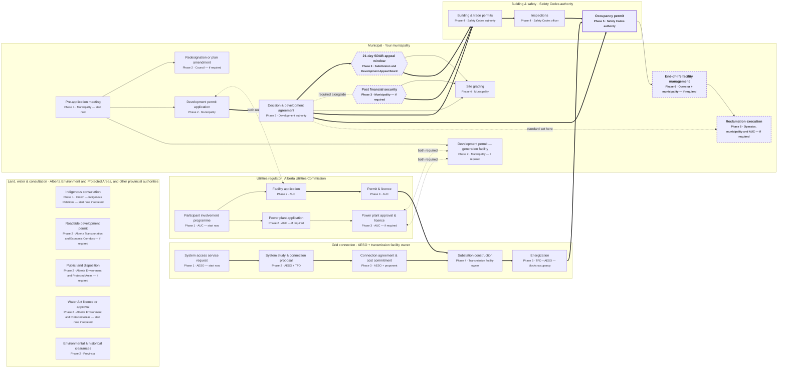

# Approvals flowcharts

Generated by `scripts/build-mermaid.mjs` from `site/data/approvals.json`.
Do not edit this file by hand — edit the data and re-run the script, so the
interactive diagram, the print sheet and these charts stay in agreement.

> Mermaid has no true swimlanes. Each lane below is a subgraph and each card
> names its phase, but the layout is Mermaid's own — the phase *columns* only
> exist on the site's own diagram and its print sheet.

## Phases

| Phase | Stage | |
|---|---|---|
| Phase 1 | Scoping | Before anything is filed |
| Phase 2 | Filings | Applications go in |
| Phase 3 | Decisions | Authorities decide |
| Phase 4 | Construction | Build and power the site |
| Phase 5 | Occupancy | Legal use begins |
| Phase 6 | Lifecycle & decommissioning | After the building is in use |

## Notation

| Mark | Meaning |
|---|---|
| `==>` thick arrow | Critical path — delay here moves the finish date |
| `-->` arrow | Must finish before |
| `<-.->` dashed, no arrowhead | Both required, neither authorises the other |
| `-.->` dashed | The standard was set at the other end, not the sequence |
| `-.-` dashed, no arrow | A parallel requirement of the same decision |
| Hexagon | A hard gate: nothing downstream starts until it clears |
| Dashed border, bold | Added as an execution or financial risk — see the notes |

## Grid-connected

Load served from the AESO transmission system through a substation built by the transmission facility owner.

## Off-grid — on-site generation only

Load served entirely by generation on the site. No system access service, no transmission connection, no queue.

```mermaid
flowchart LR
  subgraph grid["On-site power · Proponent, fuel supplier and the AER"]
    direction LR
    supply_concept["Islanded supply concept<br/><small>Phase 1 · Proponent — start now</small>"]
    fuel_supply["Fuel supply & pipeline<br/><small>Phase 2 · Alberta Energy Regulator</small>"]
    plant_build["Plant & substation construction<br/><small>Phase 4 · Proponent</small>"]
    plant_commission["Plant commissioning<br/><small>Phase 5 · Proponent + AUC — blocks occupancy</small>"]
  end
  subgraph auc["Utilities regulator · Alberta Utilities Commission"]
    direction LR
    auc_pip["Participant involvement programme<br/><small>Phase 1 · AUC — start now</small>"]
    auc_file["Facility application<br/><small>Phase 2 · AUC</small>"]
    auc_gen_file["Power plant application<br/><small>Phase 2 · AUC — required here</small>"]
    auc_isd["Industrial system designation<br/><small>Phase 2 · AUC — if required</small>"]
    auc_decision["Permit & licence<br/><small>Phase 3 · AUC</small>"]
    auc_gen_approval["Power plant approval & licence<br/><small>Phase 3 · AUC — required here</small>"]
    auc_isd_order["Designation order<br/><small>Phase 3 · AUC — if required</small>"]
  end
  subgraph env["Land, water & consultation · Alberta Environment and Protected Areas, and other provincial authorities"]
    direction LR
    crown_consultation["Indigenous consultation<br/><small>Phase 1 · Crown — Indigenous Relations — start now, if required</small>"]
    roadside_permit["Roadside development permit<br/><small>Phase 2 · Alberta Transportation and Economic Corridors — if required</small>"]
    public_lands["Public land disposition<br/><small>Phase 2 · Alberta Environment and Protected Areas — if required</small>"]
    water_licence["Water Act licence or approval<br/><small>Phase 2 · Alberta Environment and Protected Areas — start now, if required</small>"]
    env_other["Environmental & historical clearances<br/><small>Phase 2 · Provincial</small>"]
  end
  subgraph muni["Municipal · Your municipality"]
    direction LR
    muni_preapp["Pre-application meeting<br/><small>Phase 1 · Municipality — start now</small>"]
    muni_redesignate["Redesignation or plan amendment<br/><small>Phase 2 · Council — if required</small>"]
    muni_dp["Development permit application<br/><small>Phase 2 · Municipality</small>"]
    muni_dp_generation["Development permit — generation facility<br/><small>Phase 2 · Municipality — if required</small>"]
    muni_decision["Decision & development agreement<br/><small>Phase 3 · Development authority</small>"]
    sdab_appeal{{"21-day SDAB appeal window<br/><small>Phase 3 · Subdivision and Development Appeal Board</small>"}}
    muni_security{{"Post financial security<br/><small>Phase 3 · Municipality — if required</small>"}}
    muni_grading["Site grading<br/><small>Phase 4 · Municipality</small>"]
    eol_management["End-of-life facility management<br/><small>Phase 6 · Operator + municipality — if required</small>"]
    reclamation["Reclamation execution<br/><small>Phase 6 · Operator, municipality and AUC — if required</small>"]
  end
  subgraph safety["Building & safety · Safety Codes authority"]
    direction LR
    building_permit["Building & trade permits<br/><small>Phase 4 · Safety Codes authority</small>"]
    inspections["Inspections<br/><small>Phase 4 · Safety Codes officer</small>"]
    occupancy["Occupancy permit<br/><small>Phase 5 · Safety Codes authority</small>"]
  end

  supply_concept ==> fuel_supply
  auc_gen_approval --> plant_build
  auc_decision ==> plant_build
  fuel_supply ==> plant_build
  plant_build ==> plant_commission
  auc_pip --> auc_file
  auc_file ==> auc_decision
  muni_preapp --> muni_redesignate
  muni_preapp --> muni_dp
  muni_dp <-.-> |both required| auc_file
  muni_dp ==> muni_decision
  muni_decision ==> sdab_appeal
  muni_decision -.- |required alongside| muni_security
  muni_decision --> muni_grading
  sdab_appeal --> muni_grading
  muni_security --> muni_grading
  muni_decision ==> building_permit
  sdab_appeal ==> building_permit
  muni_security ==> building_permit
  building_permit ==> inspections
  inspections ==> occupancy
  plant_commission ==> occupancy
  muni_decision ==> occupancy
  auc_pip --> auc_gen_file
  auc_gen_file --> auc_gen_approval
  auc_gen_approval <-.-> |both required| muni_dp_generation
  auc_pip --> auc_isd
  auc_isd --> auc_isd_order
  muni_preapp --> muni_dp_generation
  muni_dp_generation <-.-> |both required| auc_gen_approval
  occupancy --> eol_management
  eol_management --> reclamation
  muni_decision -.-> |standard set here| reclamation

  classDef risk stroke-dasharray:6 4,stroke-width:2px,font-weight:bold;
  classDef gate stroke-width:3px,font-weight:bold;
  class sdab_appeal,muni_security,eol_management,reclamation risk;
  class occupancy gate;
```

## Source tiers

Every card carries one. Nothing below `primary` states a requirement.

| Card | Tier |
|---|---|
| System access service request | primary |
| System study & connection proposal | primary |
| Connection agreement & cost commitment | unverified |
| Substation construction | primary |
| Energization | primary |
| Islanded supply concept | unverified |
| Fuel supply & pipeline | unverified |
| Plant & substation construction | unverified |
| Plant commissioning | unverified |
| Participant involvement programme | primary |
| Facility application | primary |
| Permit & licence | primary |
| Indigenous consultation | unverified |
| Roadside development permit | unverified |
| Public land disposition | unverified |
| Water Act licence or approval | primary |
| Environmental & historical clearances | primary |
| Pre-application meeting | primary |
| Redesignation or plan amendment | primary |
| Development permit application | primary |
| Decision & development agreement | primary |
| 21-day SDAB appeal window | unverified |
| Post financial security | unverified |
| Site grading | unverified |
| Building & trade permits | primary |
| Inspections | primary |
| Occupancy permit | primary |
| Power plant application | primary |
| Power plant approval & licence | primary |
| Industrial system designation | unverified |
| Designation order | unverified |
| Development permit — generation facility | unverified |
| End-of-life facility management | unverified |
| Reclamation execution | unverified |

